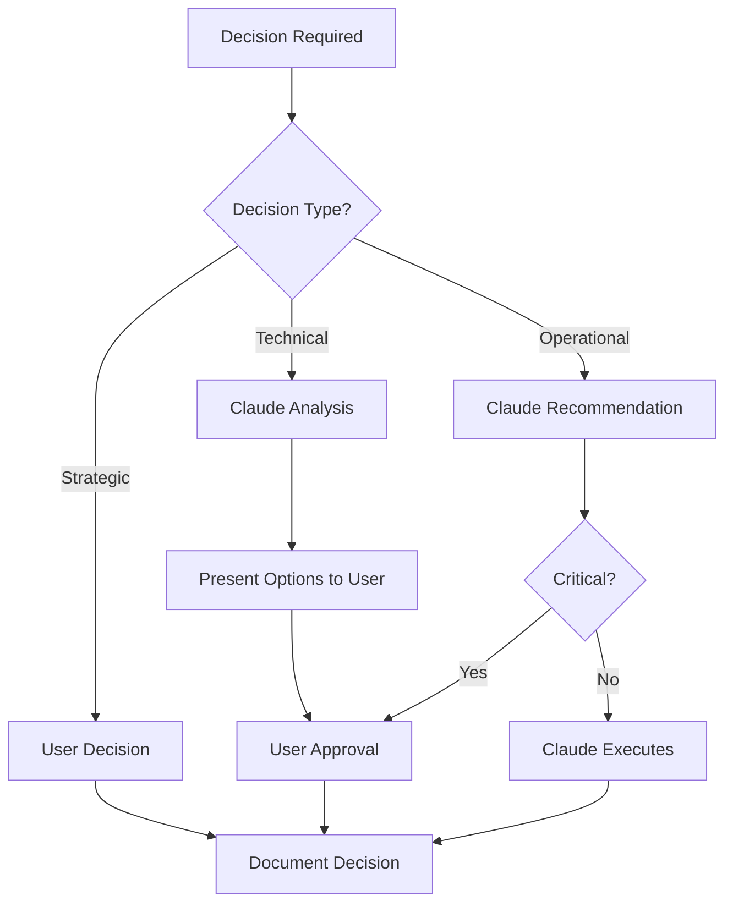

# Project Governance Framework

## Overview
This document establishes the governance structure for the context-extender project, including decision-making frameworks, accountability models, and governance SME subagents that Claude can consult throughout the project lifecycle.

## Governance Structure

### Current State (User + Claude)
```
Project Sponsor/Owner: User
├── Strategic Decisions: User
├── Technical Decisions: User (with Claude recommendations)
├── Operational Decisions: Claude (with User approval)
└── Administrative Tasks: Claude
```

### Future State (Expanded Team)
```
Steering Committee
├── Project Sponsor
├── Technical Lead
├── Product Owner
└── Key Stakeholders
    ├── Technical Board
    ├── Security Board
    └── Quality Board
```

## Decision Framework

### Decision Categories and Authority

| Decision Type | Authority Level | Approval Required | Documentation |
|--------------|-----------------|-------------------|---------------|
| **Strategic** | | | |
| Project Vision/Goals | User | User only | `docs/project-charter.md` |
| Major Scope Changes | User | User only | `docs/scope-changes/` |
| Cycle Objectives | User | User only | `cycles/cycle-XXX/objectives.md` |
| **Technical** | | | |
| Architecture Design | User + Claude | User approval | `planning/architecture.md` |
| Technology Selection | User + Claude | User approval | `docs/adr/` |
| API Design | Claude | User review | `api/specifications/` |
| Code Implementation | Claude | Code review | Pull requests |
| **Operational** | | | |
| Phase Transitions | Claude | User approval | Phase gates |
| Daily Priorities | Claude | None | `implementation/daily-plan.md` |
| Risk Mitigation | Claude | User (if High/Critical) | `risk-management/` |
| **Administrative** | | | |
| Documentation | Claude | None | Various |
| Status Updates | Claude | None | `.claude/current_status` |
| Metrics Collection | Claude | None | `metrics/` |

## Governance SME Subagents

### 1. Technical Governance SME
**File**: `.claude/sme/technical_governance.md`
**Purpose**: Provides technical oversight and architectural guidance
**Consultation Triggers**:
- Architecture design decisions
- Technology stack changes
- Performance optimization strategies
- Security implementation approaches
- Technical debt prioritization

### 2. Quality Governance SME
**File**: `.claude/sme/quality_governance.md`
**Purpose**: Ensures quality standards and best practices
**Consultation Triggers**:
- Quality gate definitions
- Testing strategy development
- Code review standards
- Documentation requirements
- Performance benchmarks

### 3. Risk Governance SME
**File**: `.claude/sme/risk_governance.md`
**Purpose**: Manages risk assessment and mitigation strategies
**Consultation Triggers**:
- Risk identification and assessment
- Mitigation strategy development
- Risk escalation decisions
- Contingency planning
- Risk monitoring approaches

### 4. Process Governance SME
**File**: `.claude/sme/process_governance.md`
**Purpose**: Maintains process integrity and continuous improvement
**Consultation Triggers**:
- Process deviation requests
- Workflow optimizations
- Phase gate criteria
- Retrospective action items
- Process metrics analysis

## Governance Processes

### Decision Making Process



### Escalation Matrix

| Issue Level | Response Time | Escalation To | Action Required |
|------------|---------------|---------------|-----------------|
| **Critical** | Immediate | User | Stop work, await decision |
| **High** | Within 4 hours | User | Complete current task, then address |
| **Medium** | Within 1 day | User (inform) | Address in next planning session |
| **Low** | Next cycle | Document only | Include in retrospective |

### Governance Gates

#### Phase Transition Gates
Each phase transition requires governance review:

**Gate Criteria Template**:
```markdown
## Phase Transition Gate: [Phase] → [Next Phase]

### Mandatory Criteria (Must Pass)
- [ ] All phase deliverables complete
- [ ] No critical risks unmitigated
- [ ] User approval obtained
- [ ] Documentation updated

### Quality Criteria (Should Pass)
- [ ] Test coverage meets standards
- [ ] Technical debt within limits
- [ ] Performance benchmarks met
- [ ] Stakeholder feedback positive

### Decision
- **Pass**: Proceed to next phase
- **Conditional Pass**: Proceed with noted actions
- **Fail**: Remain in current phase, address gaps
```

## Governance Meetings

### Current State (Integrated into Workflow)
- **Strategic Review**: Start of each cycle (Research Day 1)
- **Technical Review**: Planning Day 2
- **Risk Review**: Planning Day 3
- **Quality Review**: Review Day 2
- **Process Review**: Review Day 3 (Retrospective)

### Future State (Formal Meetings)
- **Steering Committee**: Monthly
- **Technical Board**: Bi-weekly
- **Risk Committee**: Weekly during high-risk periods
- **Quality Board**: End of each cycle

## Governance Metrics

### Decision Metrics
- Decision turnaround time
- Decisions reversed/changed
- Escalation frequency
- Approval vs rejection ratio

### Process Metrics
- Gate passage rate (first attempt)
- Process compliance score
- Deviation requests
- Continuous improvement items implemented

### Quality Metrics
- Defect escape rate
- Rework percentage
- Technical debt ratio
- Documentation completeness

## Governance Documentation

### Required Governance Documents

```
.claude/
├── governance/
│   ├── charter.md                 # Project charter and mandate
│   ├── decision-log.md            # All strategic decisions
│   ├── escalation-log.md          # Escalated issues and resolutions
│   └── gate-reviews/              # Phase gate review records
├── sme/                           # SME subagent definitions
│   ├── technical_governance.md
│   ├── quality_governance.md
│   ├── risk_governance.md
│   └── process_governance.md
└── processes/
    └── project_governance.md      # This document
```

### Decision Log Template

```markdown
## Decision Log Entry

**Decision ID**: D-XXX-001
**Date**: YYYY-MM-DD
**Category**: Strategic | Technical | Operational
**Decision Maker**: User | Claude (approved by User)

### Context
[Background and need for decision]

### Options Considered
1. [Option 1 with pros/cons]
2. [Option 2 with pros/cons]
3. [Option 3 with pros/cons]

### Decision
[Selected option and rationale]

### Impact
- Timeline: [Impact on schedule]
- Resources: [Impact on resources]
- Risk: [New risks introduced]
- Dependencies: [Affected components]

### Follow-up Actions
- [ ] [Action 1]
- [ ] [Action 2]

### Review Date
[When to review decision effectiveness]
```

## Accountability Model

### RACI for Governance Activities

| Activity | User | Claude | Future: Tech Lead | Future: PMO |
|----------|------|--------|------------------|-------------|
| Set Vision | A,R | C | C | I |
| Define Requirements | A,R | C | C | I |
| Technical Design | A | R | R,A | I |
| Implementation | A | R | R | I |
| Quality Assurance | A | R | C | C |
| Risk Management | A | R | C | C |
| Phase Approval | A | R | C | I |
| Process Improvement | A,C | R | C | R |

## Governance Review Cycle

### Cycle-Level Review
- Occurs during Review phase
- Evaluates governance effectiveness
- Identifies improvement opportunities
- Updates governance processes

### Quarterly Governance Review
- Strategic alignment assessment
- Governance framework effectiveness
- Decision-making efficiency
- Process maturity evaluation

## Integration with 4-Phase Cycle

### Research Phase
- Governance alignment check
- Strategic objective validation
- Risk governance activation

### Planning Phase
- Technical governance review
- Quality standards definition
- Resource governance

### Implementation Phase
- Operational governance
- Daily decision support
- Issue escalation handling

### Review Phase
- Governance effectiveness assessment
- Decision audit
- Process improvement identification

## Continuous Improvement

### Governance Maturity Model

**Level 1: Ad-hoc** (Starting point)
- Informal decision-making
- Reactive governance
- Minimal documentation

**Level 2: Defined** (Current target)
- Documented processes
- Clear decision rights
- Basic metrics collection

**Level 3: Managed** (6-month target)
- Proactive governance
- Metrics-driven decisions
- Integrated risk management

**Level 4: Optimized** (Long-term)
- Predictive governance
- Automated compliance
- Continuous optimization

### Improvement Process
1. Identify governance gaps during retrospectives
2. Propose improvements with expected benefits
3. Pilot improvements in next cycle
4. Measure effectiveness
5. Standardize successful improvements