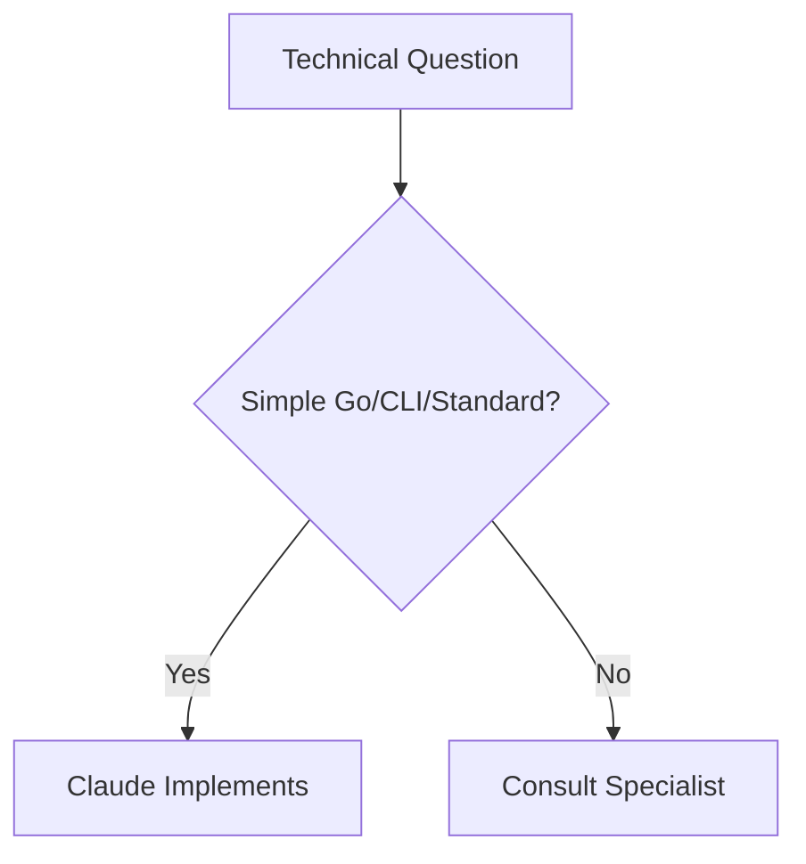
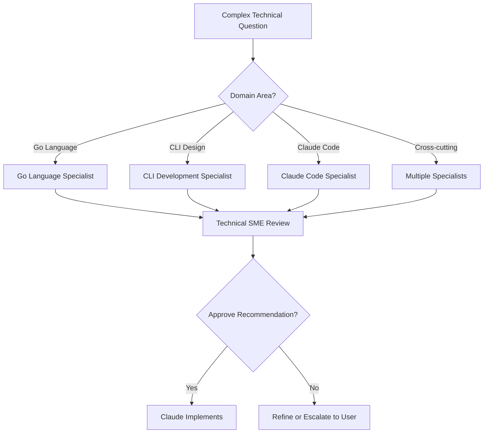
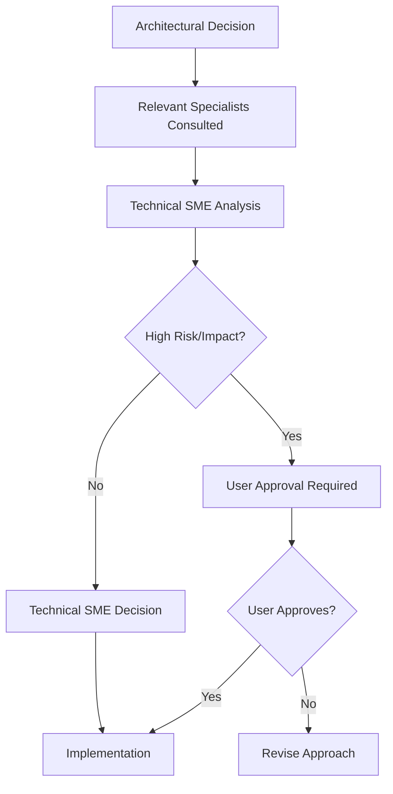

# SME Consultation Workflows

## Overview
This document defines the consultation workflows for our enhanced SME structure with specialized technical competencies, ensuring efficient decision-making while leveraging specialized expertise.

## SME Structure Summary

### Primary SMEs (Decision Authority)
1. **Technical Governance SME** - Technical decision authority with specialized competencies
2. **Quality Governance SME** - Quality standards and processes
3. **Risk Governance SME** - Risk identification and mitigation
4. **Process Governance SME** - Process compliance and improvement

### Technical Specialized Competencies (Advisory)
1. **Go Language Specialist** - Advanced Go patterns and optimization
2. **CLI Development Specialist** - Command-line interface design and UX
3. **Claude Code Specialist** - Claude Code extension and integration patterns

## Consultation Decision Trees

### Technical Decision Workflow

#### Simple Technical Decisions (Claude Autonomous)


**Examples of Simple Decisions:**
- Standard Go idioms and patterns
- Basic CLI argument parsing
- Standard testing approaches
- Common error handling patterns

#### Specialized Technical Decisions


**Examples of Specialized Decisions:**
- Advanced context manipulation patterns (Go + Claude Code)
- CLI UX design for complex commands (CLI + Claude Code)
- Performance optimization strategies (Go + Claude Code)
- Extension architecture decisions (Claude Code + Architecture)

#### Architectural Decisions


## Consultation Protocols by Scenario

### Scenario 1: Go Context Handling Implementation
**Context**: Implementing advanced context manipulation features

**Workflow:**
1. **Go Language Specialist** consulted for Go context patterns and performance
2. **Claude Code Specialist** consulted for Claude Code context integration
3. **Technical SME** synthesizes recommendations for implementation approach
4. **Quality SME** consulted for testing strategy
5. **Risk SME** consulted for performance and integration risks

**Decision Authority**: Technical SME (with specialist input)

### Scenario 2: CLI Command Structure Design  
**Context**: Designing the command-line interface for context-extender

**Workflow:**
1. **CLI Development Specialist** consulted for UX design and command patterns
2. **Claude Code Specialist** consulted for integration with Claude Code workflows
3. **Technical SME** approves overall command architecture
4. **Quality SME** consulted for CLI testing approaches
5. **Process SME** consulted for CLI development workflow

**Decision Authority**: Technical SME (with specialist input)

### Scenario 3: Claude Code Extension Architecture
**Context**: Deciding between hooks, MCP servers, or sub-agents

**Workflow:**
1. **Claude Code Specialist** consulted for extension mechanism recommendations
2. **Go Language Specialist** consulted for Go implementation patterns
3. **Technical SME** evaluates architectural implications
4. **Risk SME** assesses integration risks and security implications
5. **User approval** required for major architectural decisions

**Decision Authority**: User (with full SME input)

### Scenario 4: Performance Optimization
**Context**: Optimizing context processing performance

**Workflow:**
1. **Go Language Specialist** consulted for Go performance patterns
2. **Claude Code Specialist** consulted for Claude Code performance implications
3. **Technical SME** prioritizes optimization strategies
4. **Quality SME** consulted for performance testing approaches
5. **Risk SME** assesses performance vs reliability trade-offs

**Decision Authority**: Technical SME (with specialist input)

## Cross-SME Collaboration Patterns

### Quality Integration with Technical Specialization

#### Go Code Quality
```
Go Language Specialist → Quality SME
- Go-specific testing patterns
- Performance benchmarking approaches
- Code review criteria for Go
```

#### CLI Quality Assurance  
```
CLI Development Specialist → Quality SME
- CLI testing strategies (unit, integration, E2E)
- User experience validation approaches
- Cross-platform compatibility testing
```

#### Claude Code Integration Quality
```
Claude Code Specialist → Quality SME
- Extension testing methodologies
- Integration testing with Claude Code
- Compatibility testing across Claude Code versions
```

### Risk Assessment Integration

#### Technical Risk Assessment
```
Technical Specialists → Risk SME
- Technology risk assessment
- Integration complexity risks
- Performance and scalability risks
```

#### Implementation Risk Analysis
```
Risk SME → Technical SME
- Risk-informed technical decisions
- Risk mitigation through technical choices
- Risk monitoring through technical metrics
```

### Process Integration with Specialization

#### Development Process Optimization
```
Technical Specialists → Process SME
- Specialized development workflows
- Tool chain optimization
- Knowledge sharing processes
```

#### Compliance and Standards
```
Process SME → Technical Specialists
- Development standards compliance
- Documentation requirements
- Review processes
```

## Escalation Matrix

### Technical Escalation Levels

| Decision Complexity | Specialist Consultation | Technical SME | User Approval |
|-------------------|------------------------|---------------|---------------|
| **Simple** | Not required | Not required | Not required |
| **Moderate** | Single specialist | Approval required | Not required |
| **Complex** | Multiple specialists | Synthesis and approval | Not required |
| **Architectural** | All relevant specialists | Recommendation | Required |
| **Strategic** | All specialists + SMEs | Full analysis | Required |

### Escalation Triggers

#### Automatic Escalation to Technical SME
- Specialist recommendations conflict
- Cross-cutting technical decisions
- Architecture or design pattern changes
- Performance or security implications

#### Automatic Escalation to User
- Major architectural decisions
- Technology stack changes
- Claude Code integration approach changes
- High-risk technical decisions
- Resource allocation for technical work

## Consultation Efficiency Guidelines

### Consultation Preparation
Before consulting specialists or SMEs:
1. **Define the specific decision or problem clearly**
2. **Gather relevant context and constraints**
3. **Identify which competencies are relevant**
4. **Prepare specific questions for each specialist**

### Parallel Consultation
When multiple specialists are needed:
1. **Consult simultaneously when possible**
2. **Provide consistent context to all specialists**
3. **Flag potential conflicts or overlaps**
4. **Request integrated recommendations when appropriate**

### Documentation Requirements
For all specialist consultations:
1. **Document the decision context**
2. **Record specialist recommendations**
3. **Note Technical SME synthesis and decision**
4. **Track implementation and outcomes**

## Success Metrics

### Consultation Effectiveness
- **Decision Speed**: Time from question to decision
- **Decision Quality**: Outcomes and user satisfaction
- **Specialist Utilization**: Appropriate use of specialized expertise
- **Conflict Resolution**: How well specialist conflicts are resolved

### Knowledge Transfer
- **Learning**: How specialist knowledge transfers to general capability
- **Documentation**: Quality of decision documentation
- **Pattern Recognition**: Reuse of similar decision patterns
- **Capability Building**: Team learning from specialist consultations

## Continuous Improvement

### Consultation Pattern Analysis
- **Most Common Consultations**: Which specialists are consulted most
- **Decision Patterns**: Common decision types and outcomes  
- **Efficiency Opportunities**: Where consultations could be streamlined
- **Knowledge Gaps**: Where additional specialization might be needed

### Specialist Evolution
- **Competency Expansion**: When to add new specialist areas
- **Integration Improvement**: Better coordination between specialists
- **Decision Authority Adjustment**: When specialists should have more/less authority
- **Process Optimization**: Improving consultation workflows

This framework ensures we leverage our specialized technical competencies effectively while maintaining clear decision authority and efficient workflows.