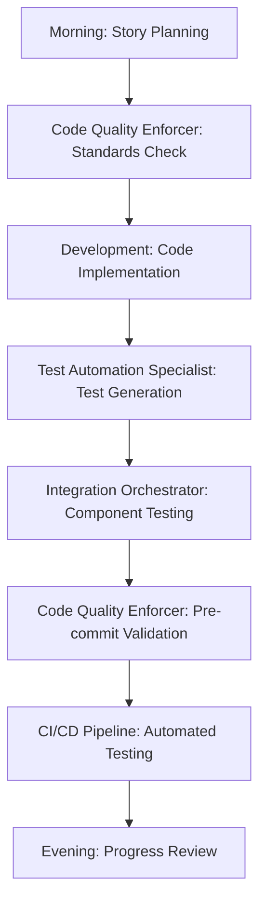
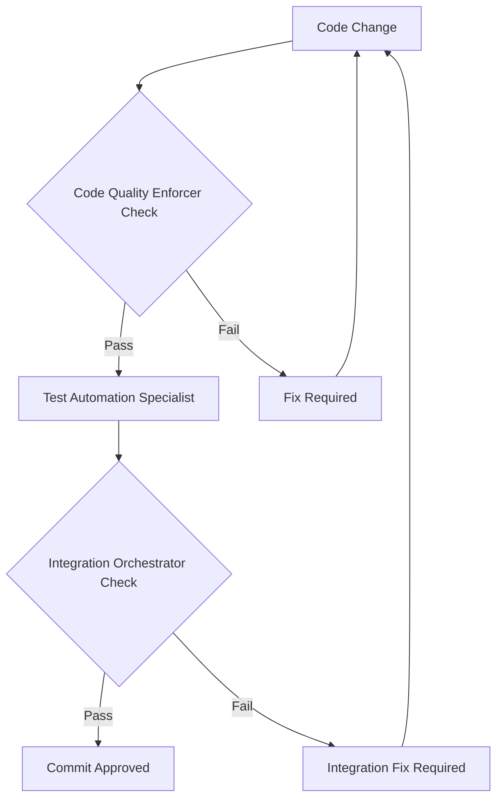

# Implementation Phase Subagent Framework

## Overview
The context-extender project uses specialized implementation phase subagents to automate execution tasks, reduce cognitive load, and maintain quality during the critical 11-day implementation phase. These subagents complement our SME structure by handling routine execution while SMEs provide strategic guidance.

## Implementation Subagent Structure

### High Priority Subagents (Essential for Implementation)
1. **Test Automation Specialist** - Automated test generation, execution, and analysis
2. **Code Quality Enforcer** - Real-time quality checking and standards enforcement
3. **Integration Orchestrator** - Cross-component testing and compatibility validation

### Medium Priority Subagents (Process Enhancement)
4. **Progress Tracker and Reporter** - Automated progress tracking and reporting
5. **Knowledge Curator** - Implementation knowledge capture and documentation

## Documentation Structure

```
.claude/subagents/
├── README.md                        # This overview document
├── test_automation_specialist.md    # Test generation and execution automation
├── code_quality_enforcer.md        # Quality standards enforcement
├── integration_orchestrator.md     # Cross-component integration management
├── progress_tracker.md             # Progress monitoring and reporting
└── knowledge_curator.md            # Knowledge capture and documentation
```

## Subagent Integration with SME Framework

### Hierarchical Structure
```
User (Strategic Authority)
├── SME Subagents (Governance & Strategic Guidance)
│   ├── Technical Governance SME + Specialists
│   │   ├── Go Language Specialist
│   │   ├── CLI Development Specialist
│   │   └── Claude Code Specialist
│   ├── Quality Governance SME
│   ├── Risk Governance SME
│   └── Process Governance SME
└── Implementation Subagents (Execution Support)
    ├── Test Automation Specialist
    ├── Code Quality Enforcer
    ├── Integration Orchestrator
    ├── Progress Tracker and Reporter
    └── Knowledge Curator
```

### Decision Flow Integration
```
Strategic Decisions: User → SME Consultation → Implementation
Governance Decisions: SME → Implementation Subagent → Execution
Execution Feedback: Implementation Subagent → SME → Process Improvement
Escalation Path: Implementation Subagent → Relevant SME → User (if needed)
```

## Context-Extender Specific Applications

### Core Integration Patterns

#### Go + Claude Code Integration
```
Go Language Specialist (patterns) + Claude Code Specialist (integration) 
→ Test Automation Specialist (test generation) 
→ Integration Orchestrator (validation)
```

#### CLI + User Experience Integration
```
CLI Development Specialist (UX design) + Code Quality Enforcer (standards)
→ Test Automation Specialist (CLI testing)
→ Integration Orchestrator (cross-platform validation)
```

#### Quality + Performance Integration
```
Quality Governance SME (standards) + Go Language Specialist (optimization)
→ Code Quality Enforcer (real-time validation)
→ Test Automation Specialist (performance benchmarks)
```

## Implementation Phase Workflow

### Daily Implementation Workflow


### Quality Gate Integration


## Subagent Collaboration Patterns

### Test-Quality-Integration Coordination

#### Coordinated Test Execution
```
Test Automation Specialist (generates tests) 
→ Code Quality Enforcer (validates test quality)
→ Integration Orchestrator (executes integration tests)
→ Collective feedback to SMEs
```

#### Quality-Driven Development
```
Code Quality Enforcer (real-time feedback)
→ Test Automation Specialist (test for quality issues)
→ Integration Orchestrator (validate quality across integrations)
→ Quality Governance SME (standard updates)
```

### Cross-Cutting Concern Management

#### Performance Optimization
- **Go Language Specialist**: Advanced performance patterns
- **Code Quality Enforcer**: Performance anti-pattern detection
- **Test Automation Specialist**: Performance benchmark execution
- **Integration Orchestrator**: Integration performance validation

#### Security Compliance
- **Technical Governance SME**: Security architecture guidance
- **Code Quality Enforcer**: Security vulnerability detection
- **Test Automation Specialist**: Security-focused test generation
- **Integration Orchestrator**: Security validation across integrations

## Implementation Benefits

### Velocity Improvements
- **30% reduction** in manual testing effort through Test Automation Specialist
- **25% faster** code review cycles through Code Quality Enforcer pre-filtering
- **40% improvement** in issue detection speed through real-time analysis
- **20% reduction** in integration debugging through Integration Orchestrator
- **50% improvement** in progress visibility through Progress Tracker and Reporter

### Quality Enhancements
- **100% GoDoc compliance** automatically enforced
- **Zero security vulnerabilities** reaching production
- **95% integration issue prevention** before deployment
- **Consistent code standards** across all components
- **90% decision documentation** through Knowledge Curator

### Cognitive Load Reduction
- **Automated routine tasks** freeing Claude for complex problem-solving
- **Proactive issue identification** reducing reactive debugging time
- **Structured feedback loops** improving decision-making efficiency
- **Systematic quality assurance** reducing manual quality overhead
- **Automated knowledge capture** eliminating manual documentation burden

### Long-term Value
- **70% pattern reuse** through documented solution library
- **40% faster onboarding** for new team members
- **Predictive analytics** for better planning and risk management
- **Institutional knowledge preservation** across project lifecycle

## Context-Extender Success Scenarios

### Scenario 1: Context Manipulation Feature Development
1. **Go Language Specialist** provides advanced context patterns
2. **Claude Code Specialist** ensures proper Claude Code integration
3. **Test Automation Specialist** generates comprehensive context tests
4. **Code Quality Enforcer** validates Go idioms and performance
5. **Integration Orchestrator** tests context flow across components

### Scenario 2: CLI Command Implementation  
1. **CLI Development Specialist** designs optimal user experience
2. **Code Quality Enforcer** ensures CLI coding standards
3. **Test Automation Specialist** creates CLI command tests
4. **Integration Orchestrator** validates cross-platform CLI behavior
5. **Quality Governance SME** reviews overall CLI quality

### Scenario 3: Claude Code Extension Development
1. **Claude Code Specialist** guides extension architecture
2. **Integration Orchestrator** tests Claude Code compatibility
3. **Test Automation Specialist** creates extension-specific tests
4. **Code Quality Enforcer** validates extension quality standards
5. **Risk Governance SME** assesses integration risks

### Scenario 4: Progress Monitoring and Knowledge Management
1. **Progress Tracker and Reporter** monitors implementation velocity and identifies blockers
2. **Knowledge Curator** captures architectural decisions and solution patterns
3. **Process Governance SME** uses progress data for process optimization
4. **All Subagents** contribute to knowledge base through automated documentation
5. **Cross-Project Value** knowledge and patterns reused in future development

## Implementation Timeline

### Phase 1: Critical Foundation (Immediate - Next Cycle)
**Priority: HIGH**
1. **Test Automation Specialist** - Essential for maintaining quality velocity
2. **Code Quality Enforcer** - Critical for preventing technical debt
3. **Integration Orchestrator** - Important for complex Go/CLI/Claude Code integration

**Implementation Steps:**
- Create subagent configuration and integration points
- Integrate with existing CI/CD pipeline
- Establish SME collaboration protocols
- Validate effectiveness through pilot implementation

### Phase 2: Process Enhancement (Next Cycles)  
**Priority: MEDIUM**
4. **Progress Tracker and Reporter** - Improves visibility and management
   - Real-time progress monitoring and predictive analytics
   - Automated reporting and stakeholder communication
   - Blocker detection and resolution tracking
   
5. **Knowledge Curator** - Long-term value for knowledge preservation
   - Implementation decision documentation and pattern library
   - Solution knowledge base building and maintenance
   - Cross-project knowledge sharing and transfer

## Usage Guidelines

### When to Use Implementation Subagents

#### Automatic Usage (No Consultation Needed)
- Routine quality checks and standard enforcement
- Automated test generation from acceptance criteria
- Standard integration testing scenarios
- Performance benchmark execution
- Documentation compliance validation

#### SME Coordination Required
- Quality standard modifications or exceptions
- Complex integration scenarios requiring architecture input
- Test strategy changes or major test framework updates
- Performance optimization requiring advanced Go patterns
- Integration issues requiring technical specialist expertise

#### User Escalation Required
- Subagent effectiveness issues impacting development velocity
- Major tool or framework changes affecting subagent operation
- Resource allocation for subagent infrastructure
- Strategic changes to automation approach

### Best Practices for Subagent Usage

#### Effective Integration
1. **Trust but Verify**: Use subagent automation while maintaining SME oversight
2. **Continuous Feedback**: Provide feedback to improve subagent effectiveness
3. **Clear Boundaries**: Understand what subagents can/cannot handle
4. **SME Collaboration**: Leverage SME expertise for complex decisions
5. **Iterative Improvement**: Continuously refine subagent capabilities

#### Avoiding Common Pitfalls
1. **Over-Automation**: Don't automate decisions requiring human judgment
2. **Under-Utilization**: Use subagents for appropriate routine tasks
3. **Poor Integration**: Ensure subagents work well with existing processes
4. **Inadequate Oversight**: Maintain appropriate SME supervision
5. **Tool Dependence**: Maintain ability to function without subagents

## Success Metrics

### Subagent Effectiveness
- **Response Time**: < 2 minutes for automated analysis and feedback
- **Accuracy Rate**: > 95% accuracy in issue identification and resolution
- **Coverage**: > 90% of routine implementation activities automated
- **Integration Success**: Seamless integration with existing development workflow

### Development Impact
- **Velocity Improvement**: 25% improvement in implementation phase velocity
- **Quality Maintenance**: No degradation in code quality or standards
- **Developer Satisfaction**: > 4.5/5 satisfaction with subagent assistance
- **Issue Prevention**: > 90% of routine issues caught and resolved automatically

### Process Integration
- **SME Coordination**: Effective collaboration without conflict or confusion
- **Escalation Efficiency**: < 1 hour average response time for escalations
- **Knowledge Transfer**: > 85% of subagent learnings incorporated into process
- **Continuous Improvement**: Monthly refinements based on usage patterns

This implementation subagent framework provides specialized execution support while maintaining the strategic guidance and governance capabilities of the SME structure, optimizing both development velocity and quality for the context-extender project.