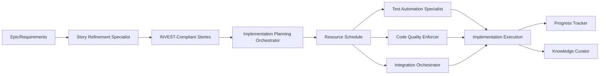

# Planning Phase Subagent Framework

## Overview
The context-extender project uses specialized planning phase subagents to automate story refinement, estimation, and implementation planning during the critical 3-day planning phase. These subagents complement the SME structure and integrate seamlessly with implementation phase subagents.

## Planning Subagent Structure

### 🔴 Priority 1: Essential Planning Automation
1. **Story Refinement Specialist** - Epic breakdown, INVEST validation, technical enrichment
2. **Implementation Planning Orchestrator** - Estimation, resource allocation, timeline creation

### 🟡 Priority 2: Decision Support Enhancement  
3. **Architecture Decision Advisor** - Technical decision analysis and ADR generation (future)
4. **Acceptance Criteria Generator** - Automated criteria generation and validation (future)

### 🟢 Priority 3: Process Optimization
5. **Planning Velocity Analyzer** - Planning metrics and continuous improvement (future)

## Complete Subagent Ecosystem

### Phase Coverage
```
Research Phase (2 days)
└── SME Consultation for feasibility and architecture exploration

Planning Phase (3 days)
├── Story Refinement Specialist
├── Implementation Planning Orchestrator
├── Architecture Decision Advisor (future)
├── Acceptance Criteria Generator (future)
└── Planning Velocity Analyzer (future)

Implementation Phase (11 days)
├── Test Automation Specialist
├── Code Quality Enforcer
├── Integration Orchestrator
├── Progress Tracker and Reporter
└── Knowledge Curator

Review Phase (3 days)
└── SME-driven retrospectives with subagent data inputs
```

## Planning-to-Implementation Handoff

### Workflow Integration


### Artifact Flow

#### From Planning to Implementation
```
Story Refinement Specialist outputs:
├── Refined user stories with technical details
├── Dependency mappings
├── INVEST validation scores
└── Risk assessments
    ↓
Implementation Planning Orchestrator outputs:
├── Story point estimates with confidence levels
├── Resource allocation matrix
├── 11-day implementation schedule
└── Risk-adjusted timelines
    ↓
Implementation Subagents receive:
├── Test Automation: Stories with acceptance criteria
├── Code Quality: Technical standards and requirements
├── Integration: Dependency sequences and integration points
├── Progress Tracker: Baseline schedule and milestones
└── Knowledge Curator: Planning decisions and rationale
```

## Context-Extender Specific Benefits

### Go Development Planning
- **Story Refinement**: Go-specific technical details and package structure recommendations
- **Estimation**: Accurate Go complexity assessment using historical patterns
- **Resource Planning**: Skill matching for advanced Go requirements
- **Risk Management**: Go-specific risk identification (concurrency, performance)

### CLI Development Planning
- **Story Refinement**: CLI command structure and UX specifications
- **Estimation**: Cross-platform testing effort calculation
- **Resource Planning**: CLI expertise allocation and scheduling
- **Risk Management**: Platform compatibility risk assessment

### Claude Code Integration Planning
- **Story Refinement**: Extension point identification and SDK requirements
- **Estimation**: Integration complexity and compatibility testing effort
- **Resource Planning**: Claude Code expertise scheduling
- **Risk Management**: Version compatibility and integration risk planning

## SME and Subagent Collaboration

### Planning Phase Collaboration Model
```
User Input
    ↓
Story Refinement Specialist
    ↓ (consults)
Technical Specialists (Go, CLI, Claude Code)
    ↓ (validates with)
Process Governance SME
    ↓
Implementation Planning Orchestrator
    ↓ (consults)
Risk Governance SME
    ↓ (provides to)
Implementation Subagents
```

### Decision Authority Matrix

| Decision Type | Planning Subagent | SME Validation | User Approval |
|--------------|------------------|----------------|---------------|
| Story breakdown | Execute | Process SME | Not required |
| Technical details | Recommend | Technical SME | Not required |
| Estimation | Calculate | Process SME | Not required |
| Resource allocation | Recommend | Process SME | Major changes only |
| Timeline creation | Generate | Risk SME | Commitment changes |
| Scope adjustments | Identify need | Process SME | Required |

## Expected Benefits

### Planning Phase Efficiency
- **50% reduction** in story refinement time through automation
- **40% improvement** in estimation accuracy using historical data
- **30% reduction** in planning phase user interaction burden
- **60% faster** epic-to-story breakdown process
- **Zero INVEST violations** reaching implementation phase

### Planning Quality Improvements
- **95% story completeness** with all technical details
- **100% dependency identification** before implementation
- **85% first-time story acceptance** without rework
- **90% estimation accuracy** within ±20% variance
- **Complete traceability** from epic to implementation task

### Implementation Phase Benefits
- **Smoother handoff** with implementation-ready artifacts
- **Reduced rework** from better upfront planning
- **Optimal resource utilization** from accurate scheduling
- **Proactive risk management** with identified mitigation
- **Clear daily objectives** from detailed work breakdown

## Implementation Roadmap

### Phase 1: Foundation (Next Cycle)
**Deploy Core Planning Automation**
```
Week 1:
- Deploy Story Refinement Specialist
- Integrate with existing planning workflow
- Train on context-extender patterns

Week 2:
- Deploy Implementation Planning Orchestrator
- Connect with story refinement outputs
- Establish estimation baselines

Expected Impact:
- 30% reduction in planning time
- Consistent story quality
- Accurate implementation schedules
```

### Phase 2: Enhancement (Cycle +1)
**Add Decision Support**
```
- Architecture Decision Advisor
- Acceptance Criteria Generator
- Integration with Knowledge Curator

Expected Impact:
- Improved technical decisions
- Complete test coverage planning
- Knowledge capture from planning
```

### Phase 3: Optimization (Cycle +2)
**Process Intelligence**
```
- Planning Velocity Analyzer
- Cross-cycle learning implementation
- Predictive planning capabilities

Expected Impact:
- Continuous process improvement
- Data-driven planning optimization
- Reduced planning overhead over time
```

## Success Metrics

### Planning Subagent Performance
- **Automation Rate**: > 80% of routine planning tasks automated
- **Processing Speed**: < 30 minutes for complete epic breakdown
- **Accuracy**: > 90% accuracy in INVEST validation
- **Integration**: 100% smooth handoff to implementation subagents
- **Reliability**: > 99% availability during planning phase

### Planning Phase Outcomes
- **Phase Duration**: Achieve 3-day planning (from current 4 days)
- **Story Quality**: 95% stories meet all quality criteria
- **Estimation Accuracy**: ±20% variance from actual effort
- **User Satisfaction**: > 4.5/5 rating for planning effectiveness
- **Implementation Readiness**: 90% stories ready for immediate start

### Long-term Value
- **Knowledge Accumulation**: Planning patterns library growth
- **Prediction Accuracy**: Improving estimation over cycles
- **Process Maturity**: Evolution to optimized planning process
- **Team Scalability**: Support 2x team growth without overhead increase
- **Cross-project Value**: Reusable patterns for future projects

## Integration with Existing Tools

### Development Tool Integration
- **Git Integration**: Story branches and commit templates
- **Project Management**: Jira/GitHub Issues synchronization
- **IDE Integration**: Story templates and snippets
- **CI/CD Pipeline**: Automated story validation
- **Documentation**: Automated story documentation generation

### Communication Channels
- **Slack/Discord**: Planning progress notifications
- **Email**: Stakeholder planning summaries
- **Dashboards**: Real-time planning status
- **Reports**: Planning phase completion reports
- **APIs**: External system integration

## Best Practices

### Effective Planning Subagent Usage
1. **Complete Epic Definition**: Ensure epics have clear scope before breakdown
2. **Early Specialist Consultation**: Involve technical specialists early
3. **Iterative Refinement**: Allow for story refinement iterations
4. **Risk Integration**: Consider risks throughout planning
5. **Continuous Learning**: Feed implementation results back to planning

### Avoiding Common Pitfalls
1. **Over-detailed Stories**: Balance detail with flexibility
2. **Under-estimated Complexity**: Account for integration complexity
3. **Rigid Planning**: Maintain adaptability for discoveries
4. **Isolation**: Ensure planning integrates with implementation
5. **Documentation Gaps**: Capture all planning decisions

## Conclusion

The planning phase subagent framework provides comprehensive automation and intelligence for the critical planning phase, ensuring high-quality, implementation-ready outputs while reducing manual overhead and improving accuracy. Combined with the implementation phase subagents, this creates an end-to-end intelligent development assistant ecosystem for the context-extender project.

The phased implementation approach allows for validation and refinement while delivering immediate value, ultimately transforming the planning phase from a manual, time-consuming process to an efficient, data-driven activity that sets up successful implementation execution.