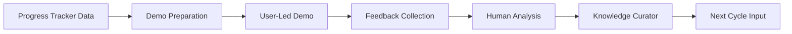
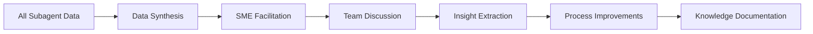

# Review Phase Strategy: SME/User-Driven Approach

## Executive Summary
After careful analysis, the context-extender project will maintain a **human-centric, SME/User-driven Review phase** rather than implementing dedicated review subagents. This decision maximizes the value of existing subagent investments while preserving the critical human elements of stakeholder engagement and strategic decision-making.

## Review Phase Characteristics

### Why Review is Different
- **Human-Centric**: Stakeholder demos, feedback, and relationship building
- **Strategic Focus**: Process improvements and next-cycle planning require human judgment
- **Short Duration**: Only 3 days (18% of cycle) doesn't justify subagent complexity
- **Existing Support**: Progress Tracker and Knowledge Curator already provide data

### Review Phase Activities (3 Days)
```
Day 1: Stakeholder Review
├── Demo preparation and execution (Human-led)
├── Feedback collection (Partially automated via existing tools)
└── Acceptance validation (Human judgment)

Day 2: Internal Review
├── Team retrospective (SME-facilitated)
├── Metrics analysis (Progress Tracker data)
└── Process improvement identification (Human insight)

Day 3: Documentation and Planning
├── Cycle documentation (Knowledge Curator support)
├── Lessons learned synthesis (Human + Knowledge Curator)
└── Next cycle preparation (Planning subagents ready)
```

## Recommended Approach: Enhanced SME/User-Driven Review

### Core Strategy
**Leverage existing subagents** for data and insights while maintaining **human control** over judgment, relationships, and strategic decisions.

### Key Principles
1. **Human Relationships First**: Stakeholder engagement remains personal
2. **Data-Informed Decisions**: Use subagent data without replacing judgment
3. **Strategic Oversight**: SMEs guide process improvements
4. **Existing Tool Enhancement**: Improve current subagents rather than add new ones

## Integration with Existing Subagents

### Progress Tracker Contributions
```markdown
Progress Tracker provides:
├── Comprehensive cycle metrics
│   ├── Velocity and completion rates
│   ├── Quality metrics and trends
│   └── Risk materialization data
├── Predictive analytics
│   ├── Next cycle capacity planning
│   └── Improvement opportunity identification
└── Automated reporting
    ├── Stakeholder dashboards
    └── Retrospective data packages
```

### Knowledge Curator Contributions
```markdown
Knowledge Curator provides:
├── Decision effectiveness analysis
│   ├── Architecture decision outcomes
│   ├── Technology choice validation
│   └── Process decision impacts
├── Pattern validation
│   ├── Solution pattern success rates
│   └── Anti-pattern identification
└── Lesson compilation
    ├── Cycle-specific learnings
    └── Cross-cycle trend analysis
```

### SME Framework Contributions
```markdown
SME Governance:
├── Process Governance SME
│   ├── Retrospective facilitation
│   ├── Process improvement identification
│   └── Review quality gates
├── Quality Governance SME
│   ├── Quality metric interpretation
│   └── Quality standard evolution
├── Risk Governance SME
│   ├── Risk review and lessons
│   └── Next cycle risk planning
└── Technical Governance SME
    ├── Technical decision validation
    └── Architecture evolution guidance
```

## Enhanced Review Workflows

### Stakeholder Review Workflow


### Retrospective Workflow


## Benefits of SME/User-Driven Approach

### Maintains Human Value
- **Relationship Building**: Personal stakeholder engagement
- **Nuanced Feedback**: Human interpretation of subjective feedback
- **Strategic Thinking**: Big-picture process improvements
- **Team Cohesion**: Shared retrospective experience

### Leverages Existing Investment
- **No New Complexity**: Avoids additional subagent coordination
- **ROI Maximization**: Better use of Progress Tracker and Knowledge Curator
- **Proven Framework**: SME structure already effective for review
- **Resource Efficiency**: Focus on high-value implementation subagents

### Preserves Flexibility
- **Adaptive Reviews**: Adjust to cycle-specific needs
- **Stakeholder Responsiveness**: React to changing priorities
- **Process Evolution**: Organic improvement based on experience
- **Human Creativity**: Innovative solutions from team discussions

## Recommended Enhancements (No New Subagents)

### Progress Tracker Enhancements
```markdown
Add Review-Specific Features:
- Cycle comparison dashboards
- Stakeholder satisfaction correlation
- Automated retrospective data packages
- Trend analysis across multiple cycles
- Predictive next-cycle metrics
```

### Knowledge Curator Enhancements
```markdown
Add Review Templates:
- Retrospective insight templates
- Lesson learned categorization
- Process change impact tracking
- Success pattern identification
- Cross-cycle knowledge synthesis
```

### Process Governance SME Framework
```markdown
Strengthen Review Facilitation:
- Structured retrospective formats
- Stakeholder engagement protocols
- Review phase quality gates
- Process improvement frameworks
- Next-cycle preparation checklists
```

## Success Metrics for Review Phase

### Review Effectiveness (Without New Subagents)
- **Stakeholder Satisfaction**: > 4.5/5 rating maintained
- **Actionable Insights**: > 5 process improvements per cycle
- **Knowledge Capture**: 100% of key decisions documented
- **Cycle Closure**: All review activities completed in 3 days
- **Next Cycle Readiness**: 100% smooth transition to next cycle

### Long-term Benefits
- **Process Maturity**: Continuous improvement without overhead
- **Team Learning**: Shared understanding through human interaction
- **Stakeholder Trust**: Personal engagement builds relationships
- **Adaptive Capability**: Flexibility to handle unique situations

## Implementation Recommendations

### Immediate Actions
1. **Enhance Progress Tracker** with review-specific dashboards
2. **Expand Knowledge Curator** templates for retrospectives
3. **Document Review Protocols** in Process Governance SME guide
4. **Create Review Checklists** for consistent execution

### Future Monitoring
- **Track Review Effectiveness** using existing metrics
- **Gather Team Feedback** on review process quality
- **Evaluate Need** for review automation after 5-6 cycles
- **Maintain Flexibility** to add review subagents if needed

## Conclusion

The Review phase's human-centric nature, short duration, and existing subagent support make it ideally suited for SME/User-driven execution. By enhancing existing tools rather than adding new subagents, we:

1. **Preserve human value** in stakeholder relationships and strategic thinking
2. **Maximize ROI** from existing Progress Tracker and Knowledge Curator
3. **Maintain simplicity** without unnecessary complexity
4. **Enable flexibility** for adaptive review processes

This approach ensures effective review phases while focusing subagent development resources on the high-value research, planning, and implementation phases where automation provides the greatest benefit.

## Complete Subagent Framework Summary

```
RESEARCH (2 days): 1 subagent + SME consultation
PLANNING (3 days): 2 subagents + SME validation  
IMPLEMENTATION (11 days): 5 subagents + SME governance
REVIEW (3 days): SME/User-driven with existing subagent data
```

Total: **8 specialized subagents** providing optimal automation where it adds most value while preserving human judgment and relationships where they matter most.