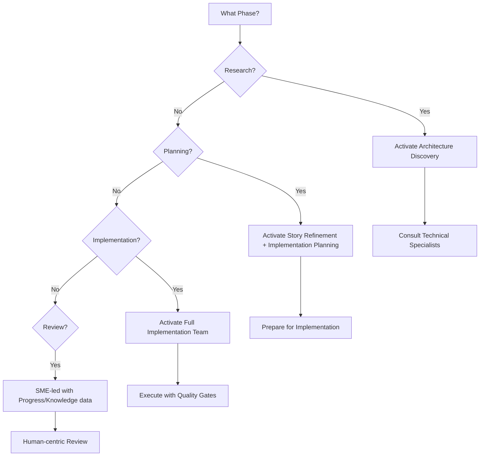

# Subagent Team Structures and Activation Guide

## Overview
This document defines which subagents Claude should activate during each phase of the 4-phase development cycle, ensuring optimal resource utilization and clear operational boundaries.

## Phase-Based Subagent Teams

### 🔬 Research Team (Days 1-2)
**Team Captain**: Process Governance SME
**Active Subagents**:
```
PRIMARY:
├── Architecture Discovery Specialist (Lead)
│   └── Explores architecture options and generates ADRs
│
SUPPORTING SMEs:
├── Technical Governance SME + Specialists
│   ├── Go Language Specialist
│   ├── CLI Development Specialist
│   └── Claude Code Specialist
├── Risk Governance SME
│   └── Identifies research-phase risks
└── Process Governance SME
    └── Ensures research process compliance
```

**Activation Trigger**: Start of cycle (Day 1)
**Deactivation**: End of Day 2
**Key Outputs**: ADRs, feasibility assessments, technical constraints

### 📋 Planning Team (Days 3-4)
**Team Captain**: Process Governance SME  
**Active Subagents**:
```
PRIMARY:
├── Story Refinement Specialist (Lead)
│   └── Breaks down epics and refines stories
├── Implementation Planning Orchestrator
│   └── Estimates and schedules implementation
│
SUPPORTING:
├── Architecture Discovery Specialist (Handoff only)
│   └── Provides ADRs and constraints
├── Knowledge Curator (Passive recording)
│   └── Captures planning decisions
│
SUPPORTING SMEs:
├── All SMEs for validation
└── Technical Specialists for estimation
```

**Activation Trigger**: Completion of Research phase
**Deactivation**: End of Day 4
**Key Outputs**: Refined stories, implementation schedule, resource allocation

### 🔨 Implementation Team (Days 5-15)
**Team Captain**: Technical Governance SME
**Active Subagents**:
```
CORE EXECUTION TEAM:
├── Test Automation Specialist
│   └── Generates and executes tests
├── Code Quality Enforcer
│   └── Real-time quality validation
├── Integration Orchestrator
│   └── Cross-component integration testing
│
CONTINUOUS MONITORING:
├── Progress Tracker and Reporter
│   └── Tracks velocity and blockers
├── Knowledge Curator
│   └── Captures decisions and patterns
│
SUPPORTING SMEs:
├── Technical Governance SME (Decision authority)
├── Quality Governance SME (Standards enforcement)
└── Risk Governance SME (Risk monitoring)
```

**Activation Trigger**: Start of Day 5
**Deactivation**: End of Day 15
**Key Outputs**: Implemented features, test results, progress reports

### 📊 Review Team (Days 16-17)
**Team Captain**: Process Governance SME
**Active Subagents**:
```
DATA PROVIDERS (Read-only mode):
├── Progress Tracker and Reporter
│   └── Provides cycle metrics and trends
├── Knowledge Curator
│   └── Compiles lessons learned
│
PRIMARY SMEs:
├── Process Governance SME (Lead)
│   └── Facilitates retrospective
├── Quality Governance SME
│   └── Quality metrics review
├── Risk Governance SME
│   └── Risk review and next cycle planning
└── Technical Governance SME
    └── Technical decision validation
```

**Activation Trigger**: Completion of Implementation phase
**Deactivation**: End of cycle
**Key Outputs**: Retrospective insights, process improvements, next cycle prep

## Subagent Activation Protocols

### Phase Transition Triggers

#### Research → Planning Transition
```markdown
TRIGGER: Day 2 completion
ACTIONS:
1. Architecture Discovery Specialist completes final ADRs
2. Story Refinement Specialist activates with ADR inputs
3. Implementation Planning Orchestrator prepares for estimation
4. Knowledge Curator switches to planning mode

HANDOFF ARTIFACTS:
- ADRs and technical decisions
- Feasibility assessments
- Identified constraints and risks
```

#### Planning → Implementation Transition
```markdown
TRIGGER: Day 4 completion + User approval
ACTIONS:
1. Story Refinement completes final stories
2. Implementation Planning finalizes schedule
3. Test Automation Specialist activates with stories
4. Code Quality Enforcer goes live
5. Integration Orchestrator prepares test suites
6. Progress Tracker begins baseline tracking

HANDOFF ARTIFACTS:
- Refined user stories with acceptance criteria
- Implementation schedule and resource allocation
- Risk mitigation plans
```

#### Implementation → Review Transition
```markdown
TRIGGER: Day 15 completion
ACTIONS:
1. All implementation subagents complete final tasks
2. Progress Tracker compiles final metrics
3. Knowledge Curator synthesizes lessons
4. Implementation subagents enter read-only mode
5. SMEs prepare for retrospective facilitation

HANDOFF ARTIFACTS:
- Final progress reports and metrics
- Captured knowledge and patterns
- Quality assessment results
```

## Subagent Communication Protocols

### Intra-Team Communication

#### Research Team Communication
```
Architecture Discovery Specialist
    ↔ Technical Specialists (consultation)
    → Knowledge Curator (documentation)
    → Planning Team (handoff)
```

#### Planning Team Communication
```
Story Refinement Specialist
    ↔ Technical Specialists (details)
    → Implementation Planning Orchestrator (estimation)
    → Test Automation Specialist (criteria)
```

#### Implementation Team Communication
```
Test Automation ↔ Code Quality (validation)
Code Quality ↔ Integration (standards)
Integration ↔ Progress Tracker (status)
All → Knowledge Curator (documentation)
```

### Cross-Team Communication

#### Critical Information Flow
```markdown
Research → Planning:
- Technical constraints
- Architecture decisions
- Identified risks

Planning → Implementation:
- User stories
- Acceptance criteria
- Implementation schedule

Implementation → Review:
- Progress metrics
- Quality results
- Lessons learned
```

## Subagent Activation Commands

### Phase Initialization Commands

#### Start Research Phase
```markdown
## Research Phase Initialization - Cycle [X] Day 1

ACTIVATE:
- Architecture Discovery Specialist (primary)
- Technical Governance SME + Specialists (advisory)
- Risk Governance SME (risk identification)

OBJECTIVES:
- Explore architecture options
- Assess technical feasibility
- Identify constraints and risks

EXPECTED OUTPUTS:
- ADRs by Day 2
- Feasibility assessment
- Risk register update
```

#### Start Planning Phase
```markdown
## Planning Phase Initialization - Cycle [X] Day 3

ACTIVATE:
- Story Refinement Specialist (primary)
- Implementation Planning Orchestrator (secondary)
- Knowledge Curator (passive)

INPUTS FROM RESEARCH:
- ADRs: [List]
- Constraints: [List]
- Risks: [List]

OBJECTIVES:
- Refine epics into stories
- Estimate and schedule work
- Allocate resources

EXPECTED OUTPUTS:
- INVEST-compliant stories
- 11-day implementation schedule
```

#### Start Implementation Phase
```markdown
## Implementation Phase Initialization - Cycle [X] Day 5

ACTIVATE FULL TEAM:
- Test Automation Specialist
- Code Quality Enforcer
- Integration Orchestrator
- Progress Tracker and Reporter
- Knowledge Curator

INPUTS FROM PLANNING:
- Stories: [Count] stories totaling [Points] points
- Schedule: Days 5-15 breakdown
- Resources: [Allocation]

OBJECTIVES:
- Implement all planned stories
- Maintain quality standards
- Track progress continuously
```

#### Start Review Phase
```markdown
## Review Phase Initialization - Cycle [X] Day 16

DEACTIVATE IMPLEMENTATION TEAM (except read-only):
- Progress Tracker (metrics only)
- Knowledge Curator (lessons only)

ACTIVATE SME TEAM:
- Process Governance SME (lead)
- All other SMEs (support)

OBJECTIVES:
- Conduct stakeholder demos
- Facilitate retrospective
- Capture improvements
- Prepare next cycle
```

## Decision Tree for Subagent Activation

### When Uncertain Which Subagents to Use



## Subagent Team Performance Metrics

### Team Effectiveness Indicators

#### Research Team Metrics
- ADR completion rate: 100% by Day 2
- Architecture option coverage: > 90%
- Risk identification: All critical risks found

#### Planning Team Metrics
- Story refinement speed: < 30 min/epic
- Estimation accuracy: ± 20%
- INVEST compliance: 100%

#### Implementation Team Metrics
- Test coverage: > 80%
- Quality gate pass rate: > 95%
- Integration success: > 90%
- Progress tracking accuracy: 100%

#### Review Team Metrics
- Stakeholder satisfaction: > 4.5/5
- Actionable insights: > 5 per cycle
- Process improvements: > 2 implemented

## Best Practices for Subagent Team Management

### Do's
✅ **Clear Handoffs**: Ensure clean artifact transfer between phases
✅ **Phase Boundaries**: Respect phase transitions and team changes
✅ **Parallel Work**: Run compatible subagents in parallel when possible
✅ **Data Persistence**: Ensure Knowledge Curator captures all decisions
✅ **SME Oversight**: Maintain SME governance throughout

### Don'ts
❌ **Phase Overlap**: Don't run planning subagents during implementation
❌ **Redundant Work**: Avoid duplicate effort between subagents
❌ **Skip Handoffs**: Always complete phase handoff protocols
❌ **Ignore Dependencies**: Respect subagent input/output dependencies
❌ **Bypass SMEs**: Don't skip SME validation for major decisions

## Quick Reference: Phase-Subagent Matrix

| Phase | Days | Lead Subagent | Supporting Subagents | SME Lead |
|-------|------|---------------|---------------------|----------|
| Research | 1-2 | Architecture Discovery | Technical Specialists | Technical |
| Planning | 3-4 | Story Refinement | Implementation Planning | Process |
| Implementation | 5-15 | Test Automation | Quality, Integration, Progress, Knowledge | Technical |
| Review | 16-17 | None (SME-led) | Progress, Knowledge (data only) | Process |

## Activation Checklist for Claude

### At Each Phase Start:
- [ ] Identify current phase from cycle day
- [ ] Activate appropriate subagent team
- [ ] Load handoff artifacts from previous phase
- [ ] Set phase-specific objectives
- [ ] Configure subagent communication channels
- [ ] Initialize progress tracking
- [ ] Verify SME availability

This structured approach ensures Claude always knows which subagents to activate, how they work together, and when to transition between teams for optimal development cycle execution.